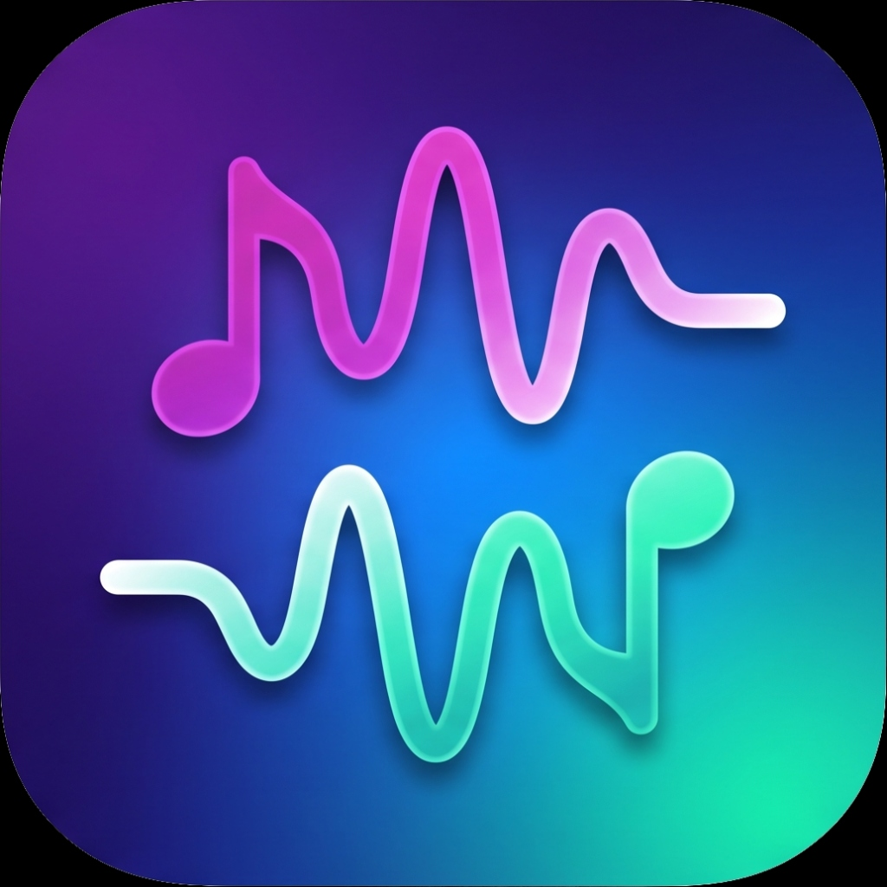

# Antiphon

<p align="center">
  
</p>

> **Antiphon**: *A responsive playlist synchronization bridge between Spotify and Apple Music.*

Antiphon is a high-performance, native macOS/iOS application built in SwiftUI that bridges the gap between Spotify and Apple Music. It allows you to link specific playlists across both streaming platforms, perform delta sync calculations, and resolve missing tracks or removals with a premium dark-themed Glassmorphic user interface.

---

## 💡 What Antiphon Solves

Streaming platforms are walled gardens. If you collaborate on a Spotify playlist with friends but listen primarily on Apple Music (or vice versa), keeping them in sync manually is a nightmare. Antiphon solves this by:
* **True Bidirectional Syncing**: Allowing updates on either platform to propagate to the other.
* **Smart Matching**: Performing robust ISRC-based matching with fallback fuzzy title/artist normalizations to handle variations in titles (e.g. `Song (Remix)` vs `Song - Remix`).
* **Conflict & Removal Flags**: Detecting track deletions and destination-only tracks, then presenting them to you in a clean, flag-resolution interface instead of silently deleting your songs.
* **Local Caching**: Keeping a local SwiftData cache of your playlist alignments to speed up subsequent scans.

---

## 🚀 Key Features

* **Glassmorphic UI**: Beautiful dark mode theme leveraging HSL-tailored colors, brand gradients, and micro-interactions.
* **Real-time Sync Indicators**: Dynamic status cards featuring colorized state icons and real-time synced counts (e.g., `1 missing, 114 synced`).
* **Detailed Audit Trails**: A scrollable history tab logging every sync event, track addition, removal, and matching failure.
* **Safety Threshold Checks**: Sync abort safety guards to prevent accidental wipes if more than 30% of a playlist's tracks are flagged for deletion.
* **Diagnostics Export**: A built-in sharing button to export plain-text alignment tables, cache states, and platform IDs for easy troubleshooting.

---

## 🛠 How It Is Built

Antiphon is built as a native Swift application using modern Apple frameworks:
* **UI**: SwiftUI (declarative layout, navigation stack, and animated transitions).
* **Database / Cache**: SwiftData (local schema models for `SyncPair`, `CachedTrack`, and `SyncLog`).
* **Concurrency**: Modern Swift Concurrency (`async/await`) with strict thread safety isolated to the `@MainActor`.
* **Project Generation**: XcodeGen (de-clutters Git by generating the `.xcodeproj` dynamically from a `project.yml` specification).

---

## 💻 How to Build and Run

### Prerequisites
* macOS 14+
* Xcode 15.0+
* Swift 5.10+
* [XcodeGen](https://github.com/yonaskolb/XcodeGen)

### Step-by-Step Setup

1. **Install XcodeGen** (if not already installed):
   ```bash
   brew install xcodegen
   ```

2. **Generate the Xcode Project**:
   Run the project generator from the root directory:
   ```bash
   xcodegen generate
   ```
   This reads `project.yml` and creates `Antiphon.xcodeproj` with all build phases, assets, and source directories correctly mapped.

3. **Open and Run**:
   ```bash
   open Antiphon.xcodeproj
   ```
   Select your target (e.g. iPhone Simulator or Mac), hit **Cmd + R**, and run!

---

## 🧘‍♂️ The "Vibecoded" Disclaimer

> [!IMPORTANT]
> **This codebase was vibecoded.** 
> It was built with absolute vibe-centric energy by highly capable agentic AI models, supervised by a human mobile developer who acted as our designated anchor to reality. 
> 
> *   **What the AI models did**: Wrote optimized NSRegularExpressions, solved strict concurrency boundaries, designed the premium Glassmorphic theme, and kept the Git files tidy.
> *   **What the developer did**: Reviewed plans, approved shell commands, prevented the models from recursively deleting the workspace database, and made sure we didn't add arbitrary Node.js packages to a native Swift application.
> 
> Proceed with caution, enjoy the smooth transitions, and may your playlists remain forever in sync.
