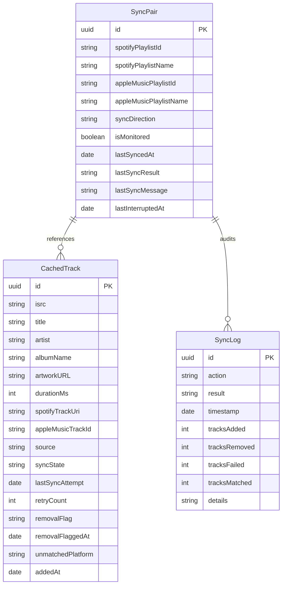

# Antiphon Architecture

This document describes the design patterns, system architecture, database schema, concurrency model, and folder structure of the Antiphon codebase. It serves as a technical source of truth for developers and AI agents.

---

## 🗺 Directory Structure

The codebase is structured around a separation of concern between platform interfaces, core synchronization engines, and SwiftUI features:

```
Antiphon/
├── App/
│   ├── AntiphonApp.swift           # Application entry point & SwiftData container setup
│   └── AppConstants.swift          # App-wide constants (URLs, thresholds, identifiers)
├── Core/
│   ├── Background/                 # Background tasks & App Intents
│   │   ├── BackgroundTaskManager.swift
│   │   └── SyncPlaylistsIntent.swift
│   ├── Extensions/                 # Utility extensions (String, Date)
│   ├── Notifications/
│   │   └── NotificationManager.swift  # Local notification permissions & sync failure alerts
│   ├── Networking/
│   │   ├── AppleMusic/             # Apple MusicKit manager, search, and playlist services
│   │   └── SpotifyAPI/             # Spotify OAuth client, token provider actor, API wrappers, and types
│   ├── Storage/
│   │   ├── KeychainManager.swift   # Secure credential storage
│   │   └── Models/                 # SwiftData schemas (SyncPair, CachedTrack, SyncLog)
│   └── Sync/
│       ├── CacheAligner.swift      # Delta engine: updates cache with live source state
│       ├── DeltaEngine.swift       # Delta engine: matches target tracks and handles additions/removals
│       ├── PlaylistCachePruner.swift# Cache pruner: deduplicates rows and clears dead references
│       ├── SyncCoordinator.swift   # Main-thread bridge: manages background SyncEngine tasks and UI state
│       ├── SyncEngine.swift        # Background orchestration Actor for sync transactions
│       ├── SyncResult.swift        # Result and progress types returned by the engine
│       └── TrackMatcher.swift      # Search rules & fuzzy string similarity matcher
├── Features/
│   ├── Dashboard/                  # Main screen list of pairs, monitoring overview, and summaries
│   ├── Inspector/                  # Detailed tab views (Tracks, Flagged, History)
│   ├── LinkWizard/                 # Linked playlist creator (platform connect, playlist search)
│   └── Settings/                   # BYOK credentials configuration and database resets
└── UI/
    ├── Components/                 # Common controls (Badges, Status indicators, PulsingDot)
    └── Theme/                      # Design system bindings (AppColors, AppFonts, AppStyles)
```

---

## ⚡ Concurrency & Thread Safety

Antiphon uses modern Swift Concurrency (`async/await`) and strict compiler isolation checks to ensure database and UI thread safety:

### 1. Actor Isolation (`SyncEngine`)
All heavy network fetches, database computations, and alignment algorithms run inside the `SyncEngine` actor.
* **Database Context isolation**: The actor creates its own dedicated `ModelContext` using `ModelContext(modelContainer)`. Because actors serialize execution, database transactions run safely off the main thread, preventing UI lag and thread violation crashes.
* **Resume Interruption Checks**: The engine records `lastInterruptedAt` if an active sync is cancelled or interrupted (e.g., app goes to background). When restarted, the engine skips Stage A and resumes Stage B matching using existing pending database states.

### 2. Token Provider (`SpotifyTokenProvider` actor)
`SpotifyTokenProvider` is a self-contained actor that manages Spotify access token lifecycle — reading tokens from Keychain, refreshing when expired, and writing updated tokens back. Because it is an actor, concurrent callers (multiple API requests hitting `validAccessToken()` simultaneously) are serialized so only one refresh can happen at a time. Any code that needs a Spotify token — foreground UI, background task, or App Intent — simply creates `SpotifyTokenProvider()` and calls `validAccessToken()`. The Keychain is the shared source of truth; multiple provider instances never share mutable in-memory state.

### 3. Main-Actor UI Isolation (`@MainActor`)
UI-facing managers are fully `@MainActor`-isolated at the class level, ensuring compile-time data-race safety for all observable state without relying on `@unchecked Sendable`:
* **`SyncCoordinator`**: A `@MainActor @Observable` class that bridges the SwiftUI UI and the background `SyncEngine` actor. It manages task handles, progress state, and sync results. `startSync()` creates a `SpotifyAPIClient` (which internally uses `SpotifyTokenProvider`) — no `SpotifyAuthManager` dependency needed.
* **`SpotifyAuthManager`**: A `@MainActor @Observable` class that owns UI-only auth state: login/logout flows (OAuth PKCE), user profile display, BYOK Client ID management, and the observable `isAuthenticated` flag. It writes tokens to Keychain during login (consumed by `SpotifyTokenProvider`), but does **not** manage token refresh or provide tokens to API callers. The `ASWebAuthenticationPresentationContextProviding` conformance uses `@preconcurrency` with `MainActor.assumeIsolated`.
* **`AppleMusicManager`**: A `@MainActor @Observable` class managing MusicKit authorization status and library access. Provides a `nonisolated init()` so SwiftUI views can create instances as stored properties. All API methods call `ensureAuthorized()` which checks `MusicAuthorization.currentStatus` live rather than relying on the cached observable property — this is critical for fresh instances created by background tasks and the sync coordinator, which never receive a `refreshStatus()` call.
* **`LinkWizardViewModel`**: A `@MainActor @Observable` class that drives the multi-step playlist linking wizard UI state.

### 4. Background Task Isolation
Background execution contexts (`BackgroundTaskManager`, `SyncPlaylistsIntent`) create a `SpotifyAPIClient()` directly — which uses its own `SpotifyTokenProvider` internally. No `SpotifyAuthManager` is needed for background work, cleanly separating background token access from foreground UI auth state.

### 5. Local Notifications
`NotificationManager` is a static utility (`enum`) that manages local notification permissions and posts alerts when background syncs fail. Permission is requested lazily on first app activation (`.active` scene phase). When `BackgroundTaskManager` or `SyncPlaylistsIntent` completes with failures, `NotificationManager.postSyncFailureNotification(results:)` delivers a grouped notification that summarises the failing playlists, giving the user a clear call to action without needing the app in the foreground.

---

## 🗄 Storage Schema (SwiftData Models)

Antiphon stores its cached configurations and results in three main database tables:



### 1. `SyncPair`
Represents a configured playlist link between Spotify and Apple Music.
* **Key fields**: `syncDirection` (unidirectional vs bidirectional), `spotifySnapshotId` (to detect remote changes), and `lastSyncResult` (stores success, failure, or partial outcomes).

### 2. `CachedTrack`
Stores the alignment metadata for a single track.
* **Matching Keys**: Dual-platform keys (`spotifyTrackUri` and `appleMusicTrackId`) mapped to a shared global key (`isrc`).
* **Conflict State**: Stores dynamic `removalFlag` (e.g. track removed on source platform) and `unmatchedPlatform` (flagged if target platform search failed).

### 3. `SyncLog`
An immutable log auditing the details of every sync action. Records specific counts for additions, removals, failures, and matches, along with diagnostic details.
* **Result Status**: The `result` field (`SyncResultStatus`) captures the overall sync outcome (success, partial, failed). This ensures failed syncs are never collapsed into "no changes" aggregates in the history UI — they are always surfaced individually with error styling.
