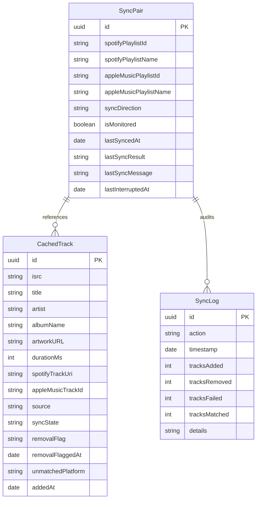

# Antiphon Architecture

This document describes the design patterns, system architecture, database schema, concurrency model, and folder structure of the Antiphon codebase. It serves as a technical source of truth for developers and AI agents.

---

## 🗺 Directory Structure

The codebase is structured around a separation of concern between platform interfaces, core synchronization engines, and SwiftUI features:

```
Antiphon/
├── App/
│   └── AntiphonApp.swift           # Application entry point & SwiftData container setup
├── Core/
│   ├── Extensions/                 # Utility extensions (String, Date, NSRegularExpression)
│   ├── Networking/
│   │   ├── AppleMusic/             # Apple MusicKit manager, search, and playlist services
│   │   └── SpotifyAPI/             # Spotify OAuth client, API wrappers, and types
│   ├── Storage/
│   │   └── Models/                 # SwiftData schemas (SyncPair, CachedTrack, SyncLog)
│   └── Sync/
│       ├── CacheAligner.swift      # Delta engine: updates cache with live source state
│       ├── DeltaEngine.swift       # Delta engine: matches target tracks and handles additions/removals
│       ├── PlaylistCachePruner.swift# Cache pruner: deduplicates rows and clears dead references
│       ├── SyncCoordinator.self    # Main-thread bridge: manages background SyncEngine tasks and UI state
│       ├── SyncEngine.swift        # Background orchestration Actor for sync transactions
│       └── TrackMatcher.swift      # Search rules & fuzzy string similarity matcher
├── Features/
│   ├── Dashboard/                  # Main screen list of pairs, monitoring overview, and summaries
│   ├── Inspector/                  # Detailed tab views (Tracks, Flagged, History)
│   ├── Settings/                   # BYOK credentials configuration and database resets
│   └── Wizard/                     # Linked playlist creator (platform connect, playlist search)
└── UI/
    ├── Components/                 # Common controls (Badges, Status indicators, PulsingDot)
    └── Theme/                      # Design system bindings (AppColors, AppFonts, AppStyles)
```

---

## ⚡ Concurrency & Thread Safety

Antiphon uses modern Swift Concurrency (`async/await`) and strict compiler isolation checks to ensure database and UI thread safety:

### 1. Actor Isolation (`SyncEngine`)
All heavy network fetches, database computations, and alignment algorithms run inside the `SyncEngine` actor.
* **Database Context isolation**: The actor creates its own dedicated `ModelContext` using `ModelContext(modelContainer)`. Because actors serialize execution, database transactions run safely off the main thread, preventing UI lag and thread violation crashes.
* **Resume Interruption Checks**: The engine records `lastInterruptedAt` if an active sync is cancelled or interrupted (e.g., app goes to background). When restarted, the engine skips Stage A and resumes Stage B matching using existing pending database states.

### 2. Main-Actor UI Isolation (`@MainActor`)
UI-facing managers are isolated to the main thread to ensure clean state propagation to SwiftUI views:
* **`SyncCoordinator`**: A `@MainActor` class that serves as the visual link between the SwiftUI UI and the background `SyncEngine` actor. It starts/stops syncs, registers progress callbacks, and exposes binding states.
* **`SpotifyAuthManager`**: Manages OAuth tokens, keychain credentials, and profiles. All mutations to its `@Observable` properties are isolated to the `@MainActor`.
* **`AppleMusicManager`**: Manages MusicKit permission checks, token refreshes, and state queries.

---

## 🗄 Storage Schema (SwiftData Models)

Antiphon stores its cached configurations and results in three main database tables:



### 1. `SyncPair`
Represents a configured playlist link between Spotify and Apple Music.
* **Key fields**: `syncDirection` (unidirectional vs bidirectional), `spotifySnapshotId` (to detect remote changes), and `lastSyncResult` (stores success, failure, or partial outcomes).

### 2. `CachedTrack`
Stores the alignment metadata for a single track.
* **Matching Keys**: Dual-platform keys (`spotifyTrackUri` and `appleMusicTrackId`) mapped to a shared global key (`isrc`).
* **Conflict State**: Stores dynamic `removalFlag` (e.g. track removed on source platform) and `unmatchedPlatform` (flagged if target platform search failed).

### 3. `SyncLog`
An immutable log auditing the details of every sync action. Records specific counts for additions, removals, failures, and matches, along with diagnostic details.
